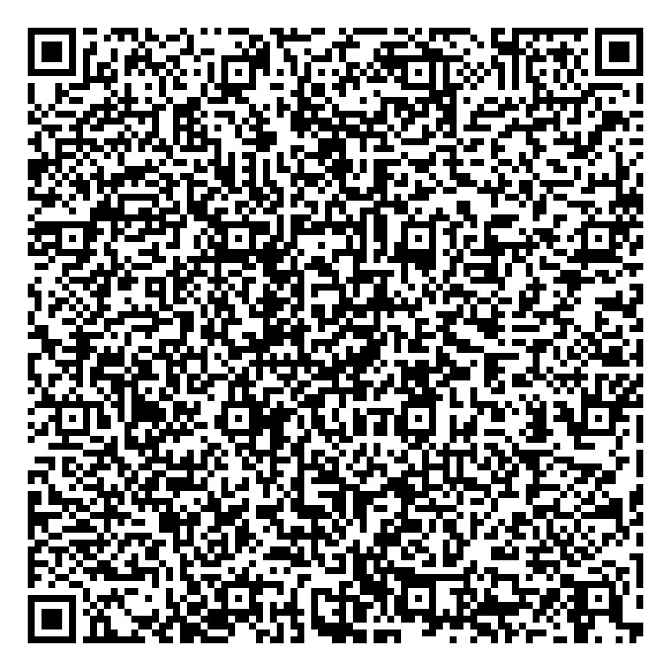

# NiceIone 체크인 태블릿 배포

NiceIone 객실 체크인 전용 Android 태블릿의 공개 배포 저장소입니다.

- 최신 운영 버전: [`v1.0.0`](https://github.com/niceione/niceione-checkin-tablet-release/releases/latest)
- 지원 기기: NTP-10, Android 11
- 앱 패키지: `kr.co.niceione.checkintablet`
- Device Owner 관리자: `kr.co.niceione.checkintablet.NiceIoneDeviceAdminReceiver`

## 설치 전에 반드시 확인

1. Device Owner 최초 등록에는 **공장 초기화가 반드시 필요**합니다. 태블릿의 기존 앱, 설정 및 자료가 삭제됩니다.
2. 먼저 시험 기기 1대만 등록하고 결제·재부팅·키오스크 동작을 확인한 후 나머지 기기를 진행합니다.
3. 공장 초기화 후에도 KIS Agent 패키지 `kr.co.kisvan.andagent`가 남는지 확인합니다. Agent가 없다면 나머지 기기를 진행하지 말고 KIS Agent 무인 설치 방식을 먼저 준비합니다.
4. 아래 QR에는 Wi-Fi 정보가 없습니다. 초기 설정 중 사용할 Wi-Fi를 직접 선택해야 합니다.

## Device Owner 설치 QR

아래 QR 하나를 신규 태블릿에 계속 재사용할 수 있습니다.

- [QR 이미지 원본 다운로드](device-owner/v1.0.0/niceione-device-owner-qr.png)
- [QR 데이터 확인](device-owner/v1.0.0/niceione-device-owner.json)

## 실제 태블릿 설치 순서

### 1. 시험 기기 한 대 등록

1. 필요한 기존 자료를 백업하고 태블릿을 공장 초기화합니다.
2. 재부팅 후 표시되는 Android 첫 환영 화면에서 빈 곳의 같은 위치를 빠르게 6번 누릅니다.
3. Wi-Fi 선택 화면이 나오면 인터넷 사용이 가능한 Wi-Fi에 연결합니다.
4. QR 스캐너가 열리면 위의 Device Owner QR을 스캔합니다.
5. `기기를 설정하는 중` 안내에 따라 초기 등록을 계속합니다. 최초 Device Owner 등록 과정의 확인 화면은 진행해야 합니다.
6. Android가 APK를 다운로드하고 체크섬을 검증한 뒤 NiceIone 앱을 Device Owner로 등록할 때까지 기다립니다.
7. NiceIone 앱이 자동으로 시작되는지 확인합니다.

첫 화면을 6번 눌러도 QR 등록 화면이 나오지 않으면 NTP-10 펌웨어가 Android Enterprise QR 프로비저닝을 지원하지 않는 것입니다. 이 경우 제조사 Device Owner/zero-touch 지원 또는 MDM이 필요합니다.

### 2. 기기별 설정

각 태블릿에서 다음 값은 서로 겹치지 않게 설정합니다.

1. 지점코드
2. 9자리 기기 ID
3. 객실코드
4. 관리자 PIN
5. 운영 결제 모드

관리자 화면에서 KIS Agent 연결과 실제 승인·취소 시험까지 완료합니다.

### 3. 시험 기기 확인

다음 항목이 모두 정상일 때만 나머지 태블릿을 등록합니다.

- 앱이 기본 HOME/키오스크 화면으로 동작한다.
- 홈·뒤로 가기로 고객이 앱을 이탈할 수 없다.
- 전원을 다시 켜면 앱이 자동으로 실행된다.
- KIS Agent가 설치되어 있고 실제 승인·취소가 정상이다.
- 지점코드, 기기 ID, 객실코드가 해당 객실과 일치한다.

### 4. 나머지 기기 반복

같은 QR을 사용해 태블릿을 계속 추가합니다. QR 자체에는 등록 대수 제한이 없습니다. 기기마다 고유한 기기 ID와 객실코드만 입력합니다.

## 자동 업데이트 동작

Device Owner 등록이 끝난 뒤에는 사용자가 APK 설치를 허용할 필요가 없습니다.

1. 앱 시작 시와 실행 중 1분마다 최신 버전을 확인합니다.
2. APK의 패키지명, 버전, 서명 및 SHA-256을 검증합니다.
3. 고객 흐름, 본인인증, 결제, 관리자 화면 또는 미완료 거래가 있으면 설치를 연기합니다.
4. 첫 화면에서 마지막 터치 후 1분 이상 지난 경우에만 자동 설치합니다.
5. 설치가 끝나면 앱이 자동으로 다시 시작됩니다.

## QR에 포함된 정보

QR에는 다음 정보만 있습니다.

- `v1.0.0` 운영 APK 공개 다운로드 주소
- Device Owner 관리자 컴포넌트명
- APK 변조 확인용 SHA-256 체크섬
- 기존 Android 시스템 앱 유지 설정

Wi-Fi 비밀번호, GitHub 계정·토큰, 지점코드, 객실코드, 기기 ID, 관리자 PIN 및 고객정보는 포함되지 않습니다.

## 운영 주의사항

- 이 QR은 `v1.0.0` APK의 체크섬과 연결되어 있으므로 `v1.0.0` Release의 APK를 교체하거나 삭제하지 않습니다.
- 이후 버전은 새로운 태그와 더 큰 `versionCode`로 게시합니다.
- 신규 기기는 QR로 `v1.0.0`을 설치한 뒤 실행 중 최신 버전으로 자동 업데이트됩니다.
- 문제가 있는 버전을 게시했을 때 Android는 낮은 `versionCode`로 자동 복귀하지 않습니다. 수정 버전은 반드시 더 큰 `versionCode`로 게시합니다.
